# Lab01 – Wdrożenie kontrolera domeny Active Directory i usługi DNS

## Cel

Instalacja i konfiguracja kontrolera domeny Active Directory oraz usługi DNS dla firmy KlovoTech Studio w VirtualBox. Utworzenie domeny ktech.lab jako pierwszego etapu infrastruktury IT rozwijanej w kolejnych laboratoriach.

## Środowisko

* Windows Server 2022 21H2
* Active Directory Domain Services (AD DS)
* DNS
* VirtualBox 7.2.8

## Założenia

* Instalacja Windows Server 2022.
* Konfiguracja statycznego adresu IP.
* Instalacja roli AD DS.
* Utworzenie nowego lasu i domeny.
* Weryfikacja poprawności działania usług AD DS i DNS.

## Przebieg

### 1. Projektowanie logicznego schematu sieci

Laboratorium rozpocząłem od przygotowania uproszczonego schematu logicznego sieci. Na schemacie oznaczyłem serwer jako DC01, bo taką nazwę planowałem nadać maszynie. Właściwą zmianę nazwy w systemie wykonałem dopiero po instalacji Windows Server.

Wybrałem tryb NAT Network w VirtualBox, bo umożliwia komunikację między maszynami wirtualnymi (w odróżnieniu od standardowego NAT, gdzie maszyny się nie widzą) i zapewnia dostęp do Internetu. W następnych laboratoriach dodam do tej sieci klientów i kolejne maszyny.

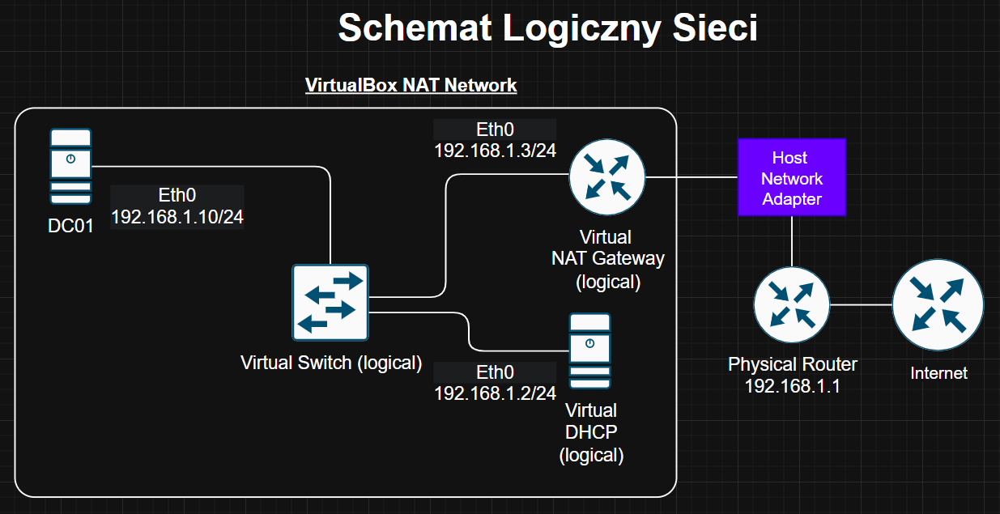

Elementy oznaczone na schemacie jako Virtual Switch (L2), Virtual NAT Gateway oraz Virtual DHCP przedstawiają logiczne usługi VirtualBox symulujące rzeczywistą infrastrukturę sieciową.

Schemat będzie rozwijany w kolejnych laboratoriach, gdy dodam do sieci klientów i kolejne maszyny.

### 2. Tworzenie sieci NAT Network

Po zaprojektowaniu architektury utworzyłem sieć NAT Network w VirtualBox. Ta sieć będzie wspólna dla wszystkich maszyn wirtualnych i przechowuje wspólną konfigurację, adresację, DHCP i NAT. Po utworzeniu sieci mogłem ją przypisywać do poszczególnych maszyn.

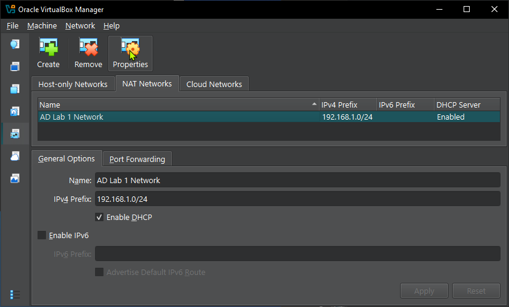

### 3. Pobranie obrazu ISO z oficjalnej strony producenta

Następnie pobrałem obraz ISO systemu Windows Server 2022 z oficjalnej [strony Microsoft](https://www.microsoft.com/en-us/evalcenter/evaluate-windows-server-2025). Wybrałem najnowszą wersję systemu, aby pracować na aktualnym środowisku. Dzięki temu przygotowałem obraz instalacyjny potrzebny do utworzenia maszyny wirtualnej.

### 4. Tworzenie maszyny wirtualnej i instalacja systemu operacyjnego

Kolejnym etapem było utworzenie maszyny wirtualnej oraz instalacja systemu Windows Server 2022 w VirtualBox. Szczegóły samego procesu instalacji opuszczam, bo celem laboratorium jest konfiguracja usług AD DS i DNS, a nie sam OS. System zainstalował się poprawnie i mogłem przejść do konfiguracji infrastruktury.

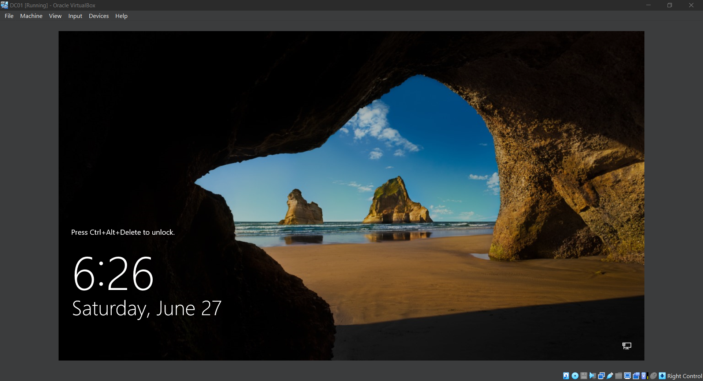

### 5. Konfiguracja statycznego adresu IP i DNS

Kolejnym krokiem była zmiana adresu IP przydzielonego automatycznie przez DHCP z 192.168.1.3 na statyczny 192.168.1.10, zgodnie z projektem sieci. Kontroler domeny udostępnia usługi dla wszystkich komputerów w sieci, bo jego adres nie powinien się zmieniać. Maszyny klienckie muszą zawsze wiedzieć, gdzie go znaleźć.

Dodatkowo, w ustawieniach adapteru sieciowego wskazałem DC01 jako serwer DNS. Kontroler domeny powinien wskazywać sam na siebie, bo wtedy poprawnie obsługuje zapytania DNS. Zrzut ekranu pokazuje wynik komendy ipconfig przed i po zmianie.

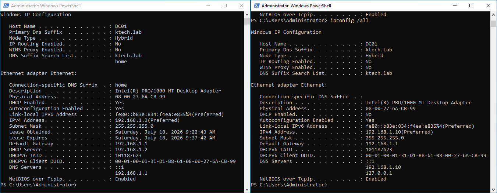

Na tym etapie nie konfigurowałem DNS Forwarders. DC01 ma łączność sieciową, ale nie przekazuje zapytań o zewnętrzne nazwy do publicznego DNS. Forwarders uzupełnię w jednym z kolejnych laboratoriów.

### 6. Zmiana nazwy serwera i aktualizacja systemu

Przed instalacją usług Active Directory zmieniłem domyślną nazwę serwera na DC01.

Wykonałem to przed promocją do kontrolera domeny, bo po utworzeniu domeny nazwa serwera stanie się częścią jego pełnej nazwy (FQDN), np. `DC01.ktech.lab`. Zmiana nazwy po utworzeniu domeny jest możliwa, ale wymaga dodatkowych czynności administracyjnych i zwiększa ryzyko problemów z konfiguracją środowiska.

Ponieważ zarówno zmiana nazwy komputera, jak i instalacja aktualizacji wymagają ponownego uruchomienia systemu, warto wykonać je przed dalszą konfiguracją. Aktualizacje Windows pobrałem poprzez Windows Update, a system wymaga restartu po instalacji.

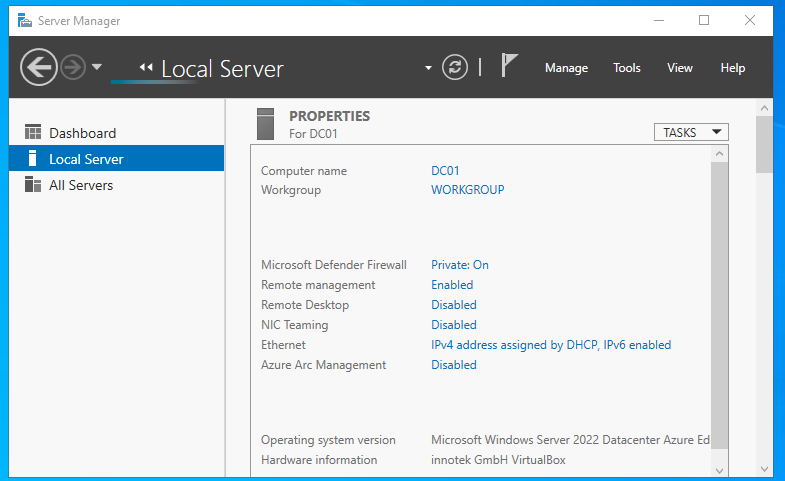

### 7. Instalacja roli Active Directory Domain Services

Kolejnym krokiem po restarcie była instalacja roli Active Directory Domain Services (AD DS) za pomocą kreatora Add Roles and Features Wizard. Instalacja tej roli dodaje komponenty wymagane do utworzenia kontrolera domeny, jednak na tym etapie serwer nie pełni jeszcze tej funkcji. Dopiero promocja serwera pozwala utworzyć domenę oraz rozpocząć pracę usług Active Directory.

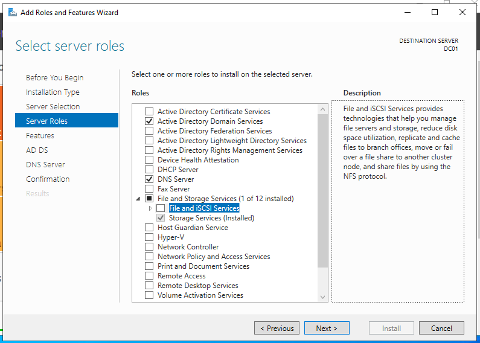

### 8. Promocja serwera do roli kontrolera domeny

Po zainstalowaniu roli AD DS rozpocząłem promocję serwera do roli Domain Controller (DC). Wybrałem utworzenie nowego lasu oraz skonfigurowałem domenę ktech.lab (skrót od KlovoTech) wraz z hasłem trybu Directory Services Restore Mode (DSRM). Po zakończeniu konfiguracji i ponownym uruchomieniu systemu serwer został pomyślnie promowany do roli kontrolera domeny, a usługi Active Directory oraz DNS zostały automatycznie skonfigurowane.

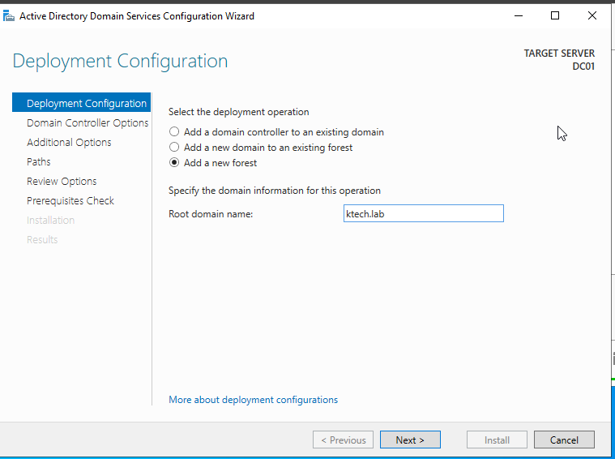

### 9. Weryfikacja

1. Otworzyłem menu Tools i sprawdziłem, czy pojawiły się w nim narzędzia administracyjne Active Directory (np. Active Directory Users and Computers).

   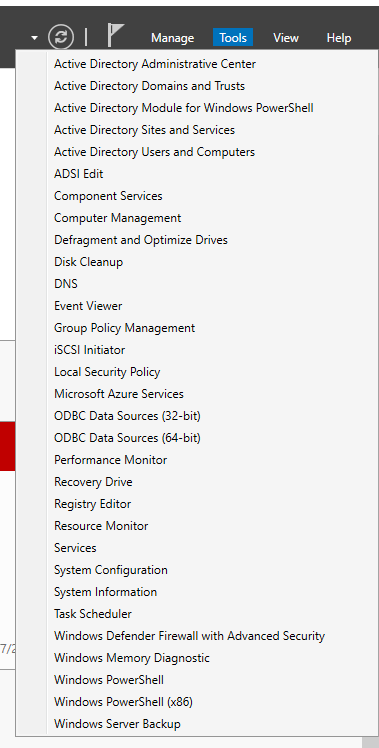
2. Uruchomiłem konsolę Active Directory Users and Computers i sprawdziłem, czy pojawiła się tam stworzona domena.

   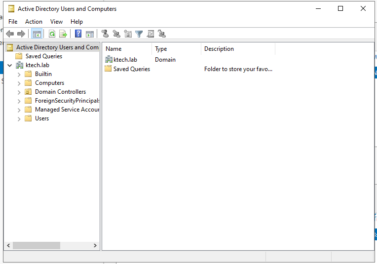
3. Sprawdziłem, czy DC01 trafił do kontenera Domain Controllers.

   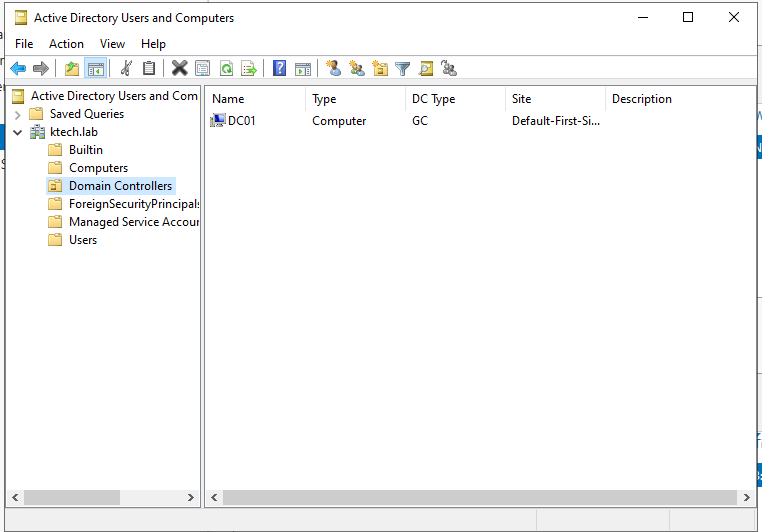
4. Otworzyłem konsolę DNS Manager i zweryfikowałem, czy została utworzona strefa ktech.lab oraz podstawowe rekordy DNS wymagane przez Active Directory.

   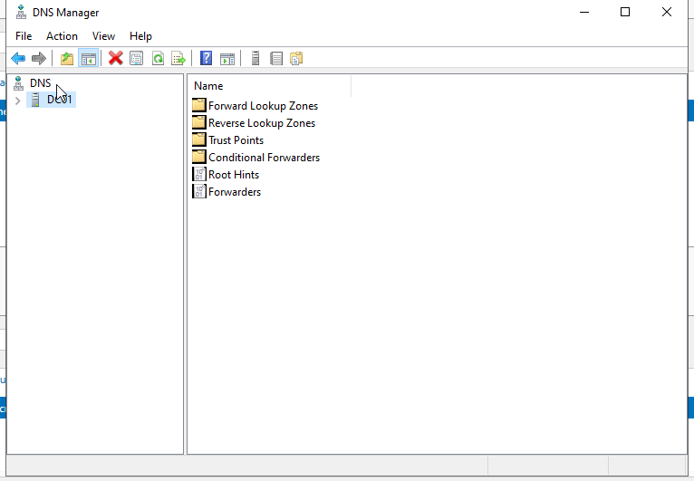

### 10. Podsumowanie laboratorium

Lab01 uznałem za zakończony. Kontroler domeny, domena `ktech.lab` i DNS działają. Najwięcej czasu zajęło mi ogarnięcie nowych pojęć i zbudowanie w głowie prostego modelu AD, zamiast samego klikania w kreatorach.

W kolejnym laboratorium zajmę się projektowaniem i rozbudową struktury OU.

## Napotkane problemy

### 1. Niska wydajność maszyn wirtualnych

Podczas pracy zauważyłem bardzo niską wydajność VirtualBox. Problem wynikał z konfliktu z funkcjami wirtualizacji Windows (Hyper-V/WSL). Wyłączyłem je w ustawieniach systemu i wydajność natychmiast się poprawiła.

### 2. Brak sieci NAT do wyboru w ustawieniach VM

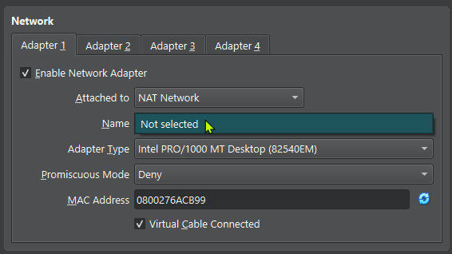

Podczas tworzenia sieci NAT Network pole Name nie pozwalało wybrać żadnej sieci. Okazało się, że trzeba najpierw utworzyć sieć w głównych ustawieniach VirtualBox (File → Tools → Network) i ustawić jej prefiks sieciowy, dopiero wtedy można ją przypisać do maszyny wirtualnej.

## Czego się nauczyłem

* Poznałem podstawowe pojęcia związane z Active Directory, takie jak Domain, Domain Controller (DC), Forest, Directory Services Restore Mode
* Nauczyłem się instalować rolę Active Directory Domain Services (AD DS) oraz promować serwer do roli kontrolera domeny.
* Zrozumiałem, dlaczego kontroler domeny powinien posiadać statyczny adres IP.
* Nauczyłem się projektować i konfigurować środowisko laboratoryjne w VirtualBox z wykorzystaniem NAT Network.
* Zrozumiałem różnicę pomiędzy instalacją roli AD DS a promocją serwera do kontrolera domeny.
* Nauczyłem się weryfikować poprawność wdrożenia Active Directory za pomocą narzędzi administracyjnych Windows Server.

