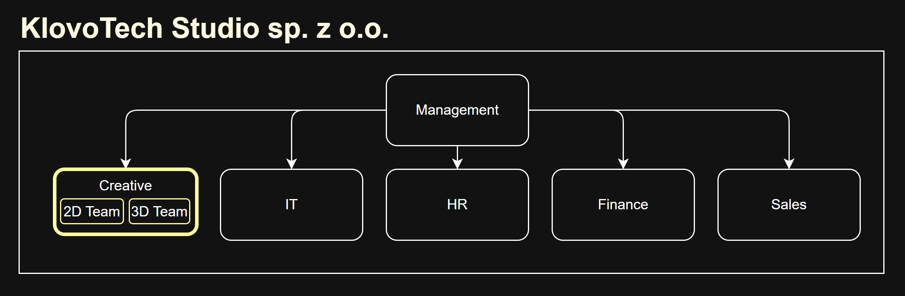
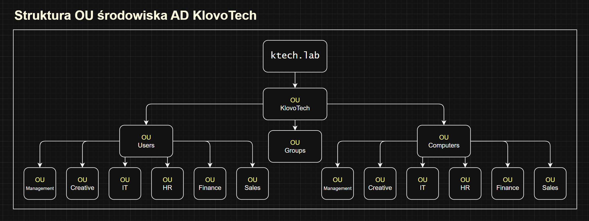
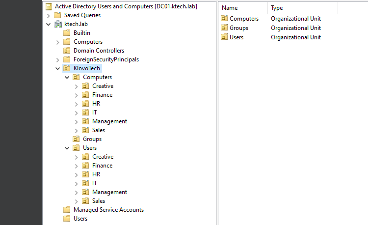
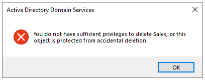

# Lab02 – Projektowanie struktury organizacyjnej Active Directory (OU)

## Cel

Zaprojektowanie struktury OU na podstawie wymagań biznesowych przykładowej firmy KlovoTech Studio. 

Utworzenie i weryfikacja struktury w domenie ktech.lab, jako kolejny etap budowy infrastruktury IT tej firmy.

Środowisko AD będzie rozwijane i uzupełniane o nowe funkcje w kolejnych laboratoriach.

## Środowisko

* Windows Server 2022 21H2
* Active Directory Domain Services (AD DS)
* DNS
* VirtualBox 7.2.8
* Domena `ktech.lab` (Lab01)
* Kontroler domeny DC01, `192.168.1.10` (statyczny)

## Założenia

* Laboratorium stanowi kontynuację projektu KlovoTech rozpoczętego w Lab01 (domena `ktech.lab`, kontroler domeny DC01). 

* Firma to studio graficzne specjalizujące się w projektowaniu grafiki 2D i 3D, identyfikacji wizualnej oraz materiałów marketingowych dla klientów biznesowych. W celu centralnego zarządzania użytkownikami, komputerami i zasobami sieciowymi firma wdrożyła środowisko Active Directory.

* Struktura organizacyjna:
   

* Charakterystyka KlovoTech Studio:
  * Jedna lokalizacja w Skierniewicach
  * 30 użytkowników
  * Kontami zarządza tylko dział IT.
  * Wrażliwe dane: księgowość, wewnętrzna dokumentacja działu IT, dokumenty działu HR.
  * Planowane zwiększenie zespołu do 100 osób w 2027 i otwarcie pododziału fotograficznego.
  * Dział Creative odpowiada za wykonanie zleceń graficznych. Pododziały często współpracują, bo firma skupia się na kompleksowych zleceniach dla dużych klientów.
  * Każdy dział ma własny pokój i własne komputery.

* Wymagania biznesowe:
  * Każdy dział musi mieć swój wspólny folder.
  * Dział IT musi mieć uprawnienia administratorów. 
  * Management ma dostęp do folderów projektowych.
  * Użytkownik może logować się z dowolnego komputera.
  * Regularne tworzenie kopii zapasowych.
  * Dezaktywacja kont zamiast usuwania.

* Weryfikacja: struktura w ADUC musi być zgodna z zaprojektowanym schematem.

## Przebieg

### 1. Analiza wymagań i projekt struktury OU

Na początku laboratorium przeanalizowałem kontekst biznesowy KlovoTech, wymagania firmy i strukturę działów z założeń. Diagram organizacyjny pokazuje, jak firma jest zorganizowana, ale nie jest gotowym projektem OU. Drzewo w AD musi wynikać z potrzeb administracyjnych IT, nie tylko z samej struktury firmy.

Na tej podstawie podjąłem decyzje projektowe:

* Zaprojektowałem OU według działów, a nie lokalizacji, bo obecnie firma ma tylko jedno biuro.

* Każdy dział ma trochę inne potrzeby biznesowe, co wymaga podziału na OU według działów i stosowania indywidualnego zestawu GPO.

* Nie było sensu dzielić dział Creative na dwie OU, bo pracownicy często współpracują, a podział w firmie jest dość umowny i często zależy od konkretnego zlecenia graficznego.

* Oddzieliłem komputery od użytkowników, żeby nie mieszać linków do GPO różnych typów obiektów w jednej OU.

* Podzieliłem komputery według działów, bo każdy dział ma swoje komputery.

* Stworzyłem osobną OU na grupy, żeby nie mieszać wizualnie grup z użytkownikami i uprościć audyt uprawnień. Grupy służą do nadawania dostępów, a GPO linkuję do OU użytkowników i komputerów.

* Lista grup w OU Groups będzie płaska, bo nie ma potrzeby komplikować struktury.

* Stworzyłem nadrzędną OU KlovoTech, bo nie chciałem mieszać stworzonych OU z wbudowanymi kontenerami AD.

### 2. Tworzenie struktury OU

Zalogowałem się na konto administratora serwera wdrożonego w pierwszym labie i stworzyłem zaprojektowaną strukturę.
   

### 3. Weryfikacja

1. Porównałem drzewo w konsoli ze schematem projektu i upewniłem się, że działy Management, Creative, IT, HR, Finance i Sales są widoczne zarówno pod użytkownikami, jak i pod komputerami.
2. Potwierdziłem, że OU Groups jest płaska i nie zawiera zbędnych pod-OU.

Struktura w AD jest zgodna z zaprojektowanym schematem.

### 4. Podsumowanie laboratorium

Lab02 uznałem za zakończony. Mam gotową strukturę OU firmy KlovoTech w domenie `ktech.lab`.

Najwięcej czasu zajęło mi zaprojektowanie schematu OU. Przerabiałem go kilka razy, bo nie od razu uwzględniłem wszystkie niuanse. Np. w pierwszej wersji nie było nadrzędnej OU `KlovoTech` ani OU `Groups`. Dodałem je, kiedy lepiej zrozumiałem rolę grup i jednostek organizacyjnych.

Kolejnym krokiem będzie utworzenie kont użytkowników i grup zabezpieczeń w Lab03.

## Napotkane problemy

### 1. Blokada przy próbie usunięcia OU

W trakcie wdrożenia struktury stworzyłem jedną zbędną OU, ale nie mogłem jej usunąć przez blokadę. 

Żeby odblokować usunięcie OU, musiałem wejść do menu `View` i odblokować ustawienia zaawansowane. W menu Properties OU trzeba było odznaczyć `Protect object from accidental deletion`. Wtedy usunięcie zadziałało.

## Czego się nauczyłem

* Lepiej zrozumiałem rolę OU i grup w zarządzaniu infrastrukturą.
* Poznałem zasady projektowania struktury Active Directory.
* Zapoznałem się z interfejsem konsoli Active Directory Users and Computers.
