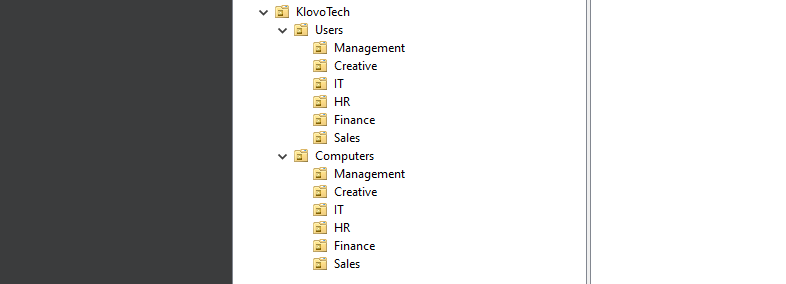
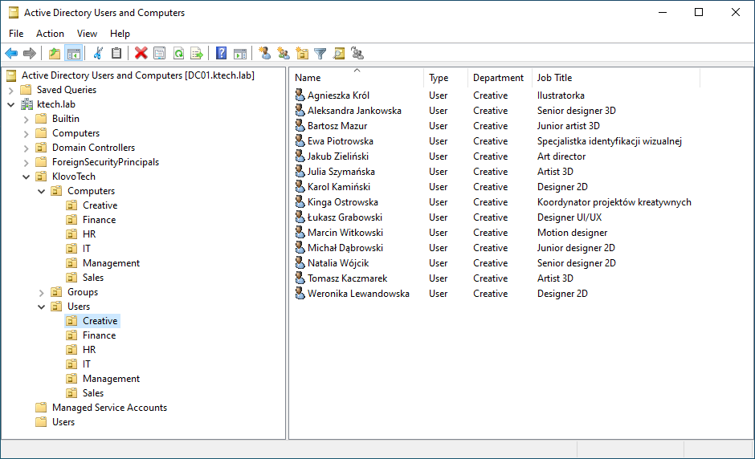

# Lab03 – Tworzenie użytkowników i grup w Active Directory

## Cel

Utworzenie kont użytkowników i grup zabezpieczeń dla firmy KlovoTech Studio w domenie `ktech.lab`, jako kolejny etap budowy infrastruktury IT rozpoczętej w Lab01 i Lab02.

Weryfikacja poprawności utworzonych obiektów w Active Directory. Test logowania domenowego zostanie przeprowadzony w Lab04 po dołączeniu komputera do domeny.

## Środowisko

* Windows Server 2022 21H2
* Active Directory Domain Services (AD DS)
* DNS
* VirtualBox 7.2.8

## Założenia

* Kontynuacja Lab01 (`ktech.lab`, DC01) i Lab02 (struktura OU). Rozbudowa infrastruktury firmy KlovoTech Studio. 

* Wymagania biznesowe firmy KlovoTech:
  * Każdy dział musi mieć swój wspólny folder.
  * Dział IT musi mieć uprawnienia administratorów. 
  * Management ma dostęp do folderów projektowych.
  * Użytkownik może logować się z dowolnego komputera.
  * Regularne tworzenie kopii zapasowych.

* Utworzenie 30 kont użytkowników według [users.md](users.md). Każde konto w OU właściwego działu.

* Wszystkie grupy utworzę jako Security o zakresie Global, bo środowisko KlovoTech działa w jednej domenie.

* Utworzenie grup zabezpieczeń dla działów oraz grup funkcyjnych (IT-Admins, dostęp Management do projektów).

* Użytkownicy są członkami grupy swojego działu. Wybrani użytkownicy należą do grup funkcyjnych.

* Konwencja atrybutów kont:
  * `First name` / `Last name`: imię i nazwisko (z polskimi znakami)
  * `Login`: imie.nazwisko (bez ą, ć, ę, ł, ń, ó, ś, ź, ż)
  * `UPN`: login@ktech.lab
  * `Department`: nazwa działu
  * `Job Title`: stanowisko
  * `Hasło`: wspólne startowe, wymuszona zmiana przy pierwszym logowaniu

* Weryfikacja poprawności w ADUC.

## Przebieg

### 1. Weryfikacja środowiska i przygotowanie

Laboratorium rozpocząłem od sprawdzenia, czy infrastruktura utworzona w Lab01 i Lab02 działa poprawnie. 

Zalogowałem się na kontroler domeny DC01 i otworzyłem konsolę Active Directory Users and Computers. Zweryfikowałem, czy w domenie `ktech.lab` istnieje zaprojektowana w Lab02 struktura OU.

Następnie zapoznałem się z listą 30 użytkowników w pliku [users.md](users.md) i z przyjętą konwencją kont (login, UPN, atrybuty Department i Job Title). 

Dopiero po tej weryfikacji mogłem przejść do tworzenia kont użytkowników.

### 2. Tworzenie użytkowników

Na podstawie listy użytkowników z pliku users.md rozpocząłem tworzenie kont w Active Directory. Każdy użytkownik został umieszczony w OU właściwego dla niego działu.

Dla każdego konta ustawiłem:
* Login zgodnie z konwencją `imie.nazwisko` (bez polskich znaków)
* UPN w formacie `login@ktech.lab`
* Atrybut Department z nazwą działu
* Atrybut Job Title ze stanowiskiem
* Hasło startowe z wymuszeniem zmiany przy pierwszym logowaniu

Każde konto zostało umieszczone w odpowiedniej OU (np. OU=Creative dla osób z działu Creative).

Przykład działu creative:

Całość może być automatyzowana za pomocą PowerShella, ale dla lepszego zrozumienia procesu wykonałem to ręcznie przez interfejs ADUC.

### 3. Tworzenie grup zabezpieczeń dla działów i grup funkcyjnych

W kolejnym kroku utworzyłem grupy zabezpieczeń dla wszystkich działów firmy oraz dodatkowe grupy funkcyjne potrzebne do późniejszego zarządzania dostępem do zasobów.

Wszystkie grupy umieściłem w OU `Groups` i przyjąłem konwencję nazewnictwa z prefiksem `GRP-`.

Grupy działowe to podstawa do nadawania uprawnień całym zespołom. Dzięki temu dostęp do wspólnych folderów i innych zasobów można przypisywać na poziomie grupy, a nie pojedynczych użytkowników.

### 4. Dodanie użytkowników do grup zabezpieczeń

Po utworzeniu wszystkich kont użytkowników przypisałem każdego do odpowiedniej grupy swojego działu. Dodatkowo użytkowników z działu IT (Robert Sadowski i Damian Czarnecki) dodałem do grupy GRP-IT-Admins. W przyszłym labie nadam tej grupie uprawnienia administratorskie.

Użytkowników z zarządu (Anna Kowalska, Piotr Nowak, Magdalena Wiśniewska) dodałem do grupy GRP-Share-Creative-Read, która będzie miała dostęp do folderów projektowych zespołu Creative.

### 5. Weryfikacja utworzonych kont i grup

W ADUC sprawdziłem, czy:
* Wszystkie 30 kont zostało utworzonych w odpowiednich OU
* Każde konto ma wypełnione atrybuty Department i Job Title
* Członkostwo w grupach jest prawidłowe, każdy użytkownik należy do grupy swojego działu
* Użytkownicy z grup funkcyjnych (GRP-IT-Admins, GRP-Share-Creative-Read) mają poprawne dodatkowe członkostwo

Logowanie domenowe zweryfikuję po dołączeniu klienta Windows 11 w Lab04.

### 6. Podsumowanie

Utworzyłem 30 kont użytkowników w odpowiednich OU działów, grupy zabezpieczeń działowe i funkcyjne, a potem przypisałem do nich użytkowników. Proces dodawania użytkowników i grup jest dość intuicyjny, choć monotonny.

W ADUC sprawdziłem strukturę OU, atrybuty kont i członkostwo w grupach. Logowanie domenowe zostawiam na Lab04. 

## Napotkane problemy

Brak poważnych problemów. Tworzenie 30 kont ręcznie w ADUC zajęło sporo czasu, ale przebiegło bez błędów.

## Czego się nauczyłem

* Poznałem konwencje i dobre praktyki tworzenia kont użytkowników w Active Directory.
* Nauczyłem się przypisywać użytkowników do grup zabezpieczeń i zarządzać członkostwem.
* Zrozumiałem, że obowiązkowa zmiana hasła przy pierwszym logowaniu to standard bezpieczeństwa.
* Zrozumiałem rolę grup zabezpieczeń w zarządzaniu dostępem do zasobów sieciowych.